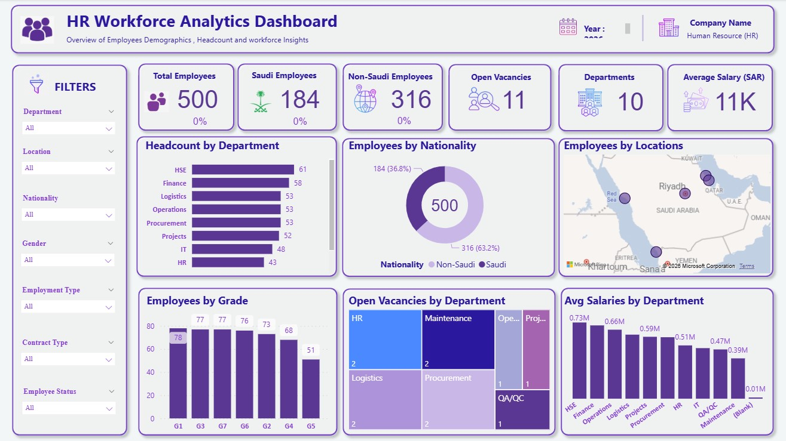

# HR-Workforce-Analytics-Dashboard

Objective:
  Developed an interactive HR analytics dashboard to provide management with a clear view of workforce composition, headcount, vacancies, employee demographics, locations, and salary insights.

Tools:
 Power BI
 DAX
 Excel

Key Features:
 Workforce headcount analysis
 Saudi vs. Non-Saudi analysis
 Department and location analysis
 Vacancy tracking
 Salary analysis
 Employee demographics
 Interactive slicers
 Dynamic KPI cards
 Map visualization
 Clear Filters functionality

 Dashboard Preview

